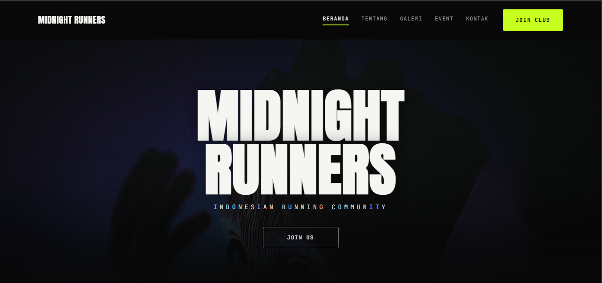
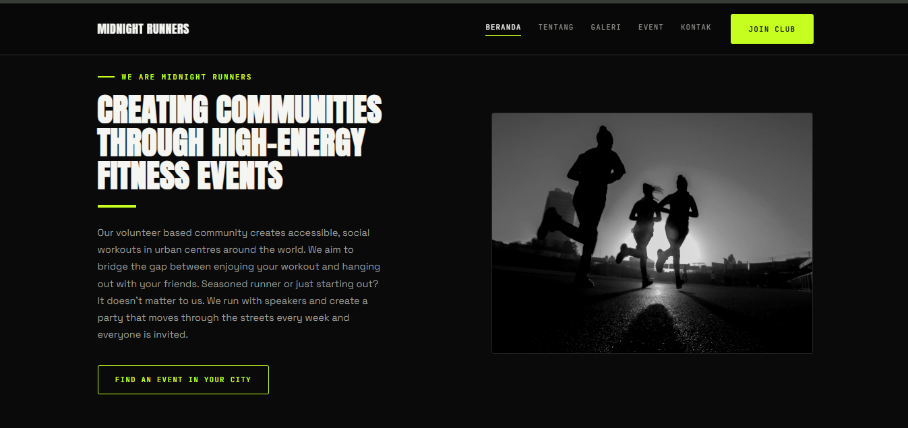
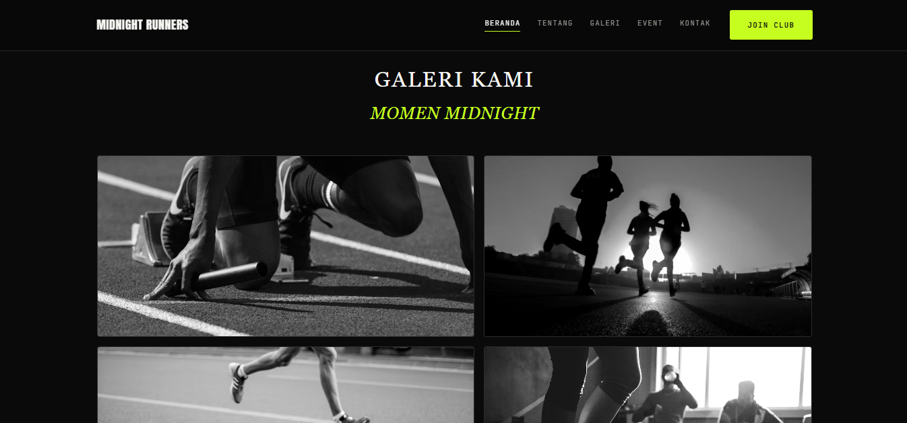
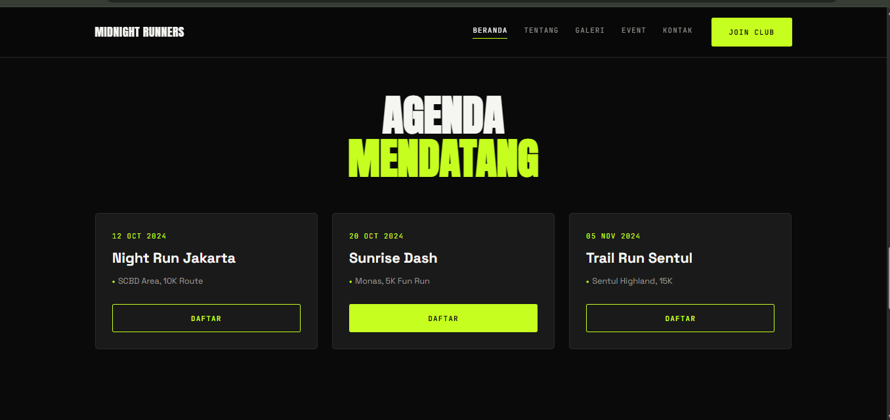
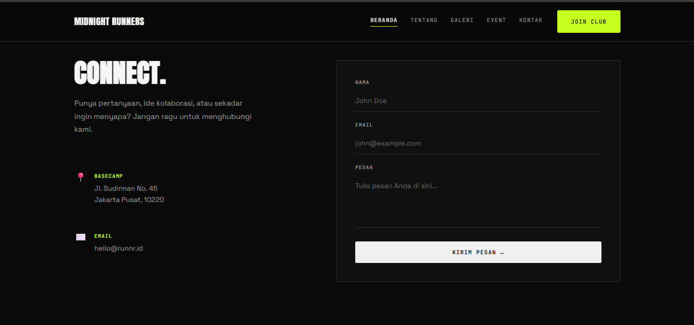
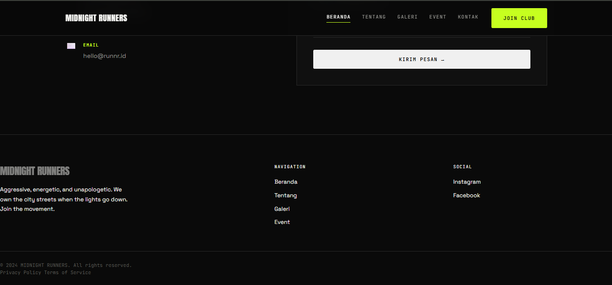

# Profil-Komunitas
Profil Komunitas

Website profil komunitas yang dibuat sebagai proyek kolaborasi tim pengembang perangkat lunak menggunakan HTML, CSS, dan JavaScript serta menerapkan workflow Git & GitHub.

📌 Tentang Project

Project ini merupakan website profil komunitas yang menyediakan beberapa informasi mengenai komunitas dalam bentuk halaman web.

Website terdiri dari beberapa bagian, di antaranya:

🏠 Beranda — halaman utama website
👥 Tentang — informasi mengenai komunitas
🖼️ Galeri — menampilkan dokumentasi atau foto kegiatan
📅 Event — informasi kegiatan atau acara komunitas
📩 Contact — halaman/formulir untuk menghubungi komunitas

Project ini dikerjakan secara berkelompok dengan menerapkan sistem kolaborasi GitHub menggunakan branch, commit, pull request, code review, dan issue.

👥 Anggota Tim
No	Nama	Role	Tugas
1	[Damar]	Project Manager / Team Lead	Mengatur repository, Issue, pembagian tugas, dan review PR
2	[Mutia]	Front-End Developer	Mengembangkan tampilan dan struktur halaman website
3	[Syifa]	Back-End / Developer	Mengerjakan fungsi dan logika website
4	[Iffat]	UI/UX & Dokumentasi	Merancang tampilan dan mengelola dokumentasi
5	[Mutia]	QA / Tester	Melakukan testing dan mencari bug

